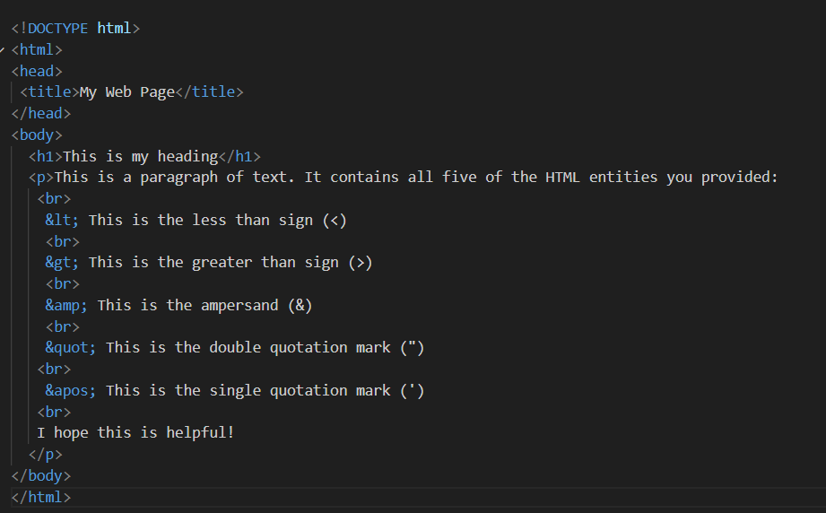

# 2 .What are HTML Entities? List out 5 commonly used HTML entities?

HTML entities are characters that are represented in HTML using special codes. These codes are called character entity references.

HTML entities are used to represent characters that cannot be typed directly into HTML, such as special characters (like <, >, and &), accented characters (like é and ü), and mathematical symbols (like π and √).

 ### Commonly used entities
 Here are 5 commonly used HTML entities:

- **`&lt;:`** Less than sign (<)
- **`&gt;:`** Greater than sign (>)
- **`&amp;:`** Ampersand (&)
- **`&quot;`** Double quotation mark (")
- **`&apos;:`** Single quotation mark (')

